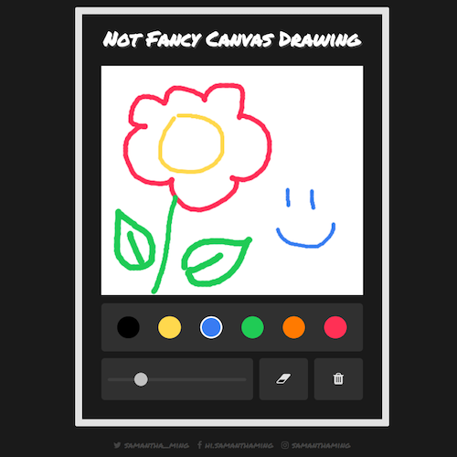

# Not Fancy 

A simple, not fancy at all, HTML5 canvas drawing.

**Features include:**

- Draw on canvas with different colors and brush thickness.
- Select different brush color and thickness.
- Select eraser and erase drawing on canvas.
- Clear canvas.

**Built using:**

- Vue
- Google Fonts - Permanent Marker
- Normalize CSS

<br>

Play around with it on [CodePen](https://codepen.io/samanthaming/pen/EpmBoX)  
Or see it live! [here](https://samanthaming.github.io/not-fancy-canvas-drawing/)

<br>




# Notes

Here are the general steps to create your own Not Fancy Canvas Drawing.

## 1. Create Canvas

We need to set the width and height of our canvas. We also add a `ref` attribute so we can select the canvas element. But note, `$refs` is non-reactive, so you shouldn't use in templates for data-binding.

> ref is used to register a reference to an element or a child component. The reference will be registered under the parent component’s $refs object.

_[Vue.js API: ref](https://vuejs.org/v2/api/#ref)_

It's similar to vanilla JS `document.querySelector('canvas').

```html
<canvas 
  ref="myCanvas" 
  width="400px" 
  height="350px"
></canvas>
```

## 2. Add Event Handler to our Canvas

Before we create the actual drawing capability, we need to figure what event listeners should we trigger the draw. We need to access the mouse events. We want the drawing to begin when the user press down on the mouse and continue drawing as they move the mouse around. And the drawing should stop, once the mouse is unpressed. So here are the 3 events we need to handle.

- `mousedown` event is fired when mouse is pressed on an element.
- `mousemove` event is fired when mouse is moved while over an element. 
- `mouseup` event is fired mouse is released over an element.

Let's add these event handler to our canvas!

```javascript
<canvas ...
  v-on:mousedown="onMouseDown"
  v-on:mousemove="onMouseMove"
  v-on:mouseup="onMouseUp"
></canvas>
```

## 3. Create our Drawing Object 

Before we deal with the function call of the mouse event, let's create our draw method first.

```javascript
methods: {
  // 1. Get a reference to our canvas
  const canvas = this.$refs.myCanvas;
  
  // 2. Create the context that indicates the drawing is 2D
  //    (another context would be 3D)
  const ctx = canvas.getContext('2d');
  
  // 3. Here we configure the how the drawing will look
  
  // Draw a line with rounded end caps
  ctx.lineCap = 'round'
  // Create a round corner when 2 lines meet
  ctx.lineJoin = 'round'; 
  // Black Color
  ctx.strokeStyle = '#000000';
  // Thickness of line drawing
  ctx.lineWidth = 3;
}
```

## 4. Create our Drawing Path 

So we just configured how the line drawing should look like. Next, we need configure the starting and go point. The starting point is when the mouse is pressed down. The go point continues as the mouse moves. When the mouse is unpressed, it stops the drawing.

```javascript
//  1. We'll store the starting points in our data
data: {
  // It's at 0,0 right now, 
  //  but this will be change where ever the mouse is pressed
  startX: 0;
  startY: 0;
  
  // This will be true or false depending on the mouse event
  isDrawing: false;
},
methods: {
  
  draw(e) {
    // if drawing is false, we'll stop this drawing method
    //  (This is called a guard clause)
    if (!this.isDrawing) {
      return;
    }
    
    // 2.Let's start
    //  (This is required since we will be using multiple colors)
    ctx.beginPath(); 
    
    // 3. Starting point
    ctx.moveTo(this.startX, this.startY);
    
    // 4. Go point
    ctx.lineTo(e.offsetX, e.offsetY);
    ctx.stroke();
    
    // 5. We want overwrite the starting point to be the go point
    //    otherwise, the starting point will always be the same and 
    //    you won't have drawing effect.
    this.startX = e.offsetX;
    this.startY = e.offsetY;
  }
}
```

## 5. Triggering our Drawing

Now we need to hook up the appropriate action when the mouse event is called.

```javascript
methods: {
  onMouseDown(e) {
    // Start the drawing
    this.isDrawing = true;
    
    // We want the starting point to be where the mouse is pressed
    this.startX = e.offsetX;
    this.startY = e.offsetY;
  },
  onMouseMove(e) {
    // Keep drawing, yay!
    this.draw(e);
  },
  onMouseUp() {
    // Stop the drawing
    this.isDrawing = false;
  }
}
```

## Using Destructuring to Shorten our Assignment

```javascript
this.lastX = e.offsetX
this.lastY = e.offsetY

// Using ES6
[this.lastX, this.lastY] = [e.offsetX, e.offsetY]
```

# Resources

_Inspired by Wes Bos' Javascript30 course_

- [Wes Bos' Javascript30 YouTube: HTML5 Canvas](https://youtu.be/8ZGAzJ0drl0)
- [Alligator.io: Controlling the HTML5 Canvas with Vue.js](https://alligator.io/vuejs/vue-html5-canvas/)
- [CodePen: Vue JS Draw](https://codepen.io/Lewitje/pen/MVommB)
- [CodePen: Vue Canvas](https://codepen.io/getflourish/pen/EyqxYE)
